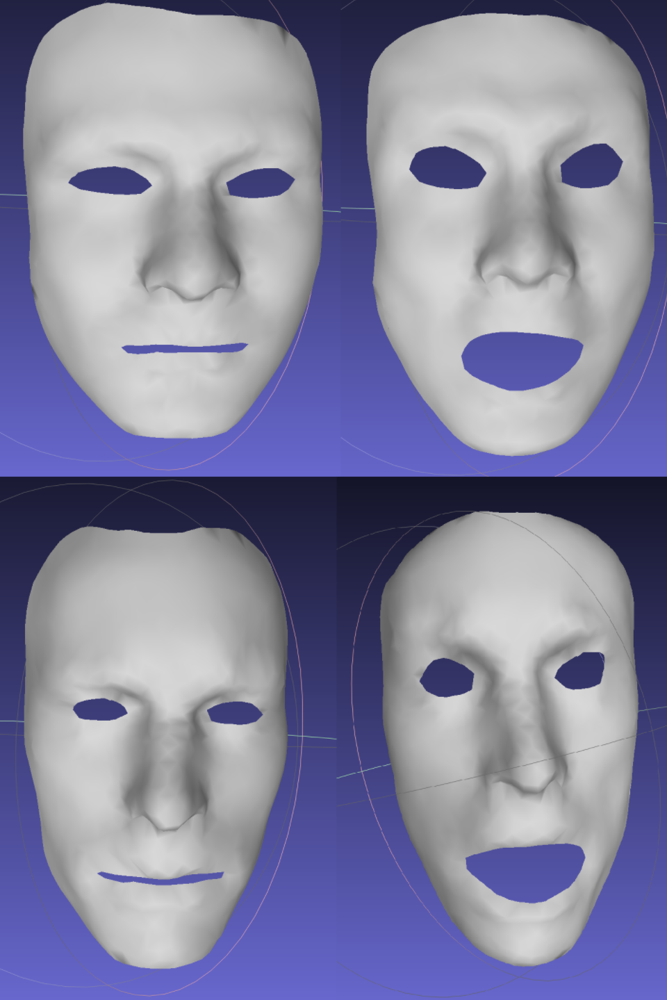

# Deformation Tranfer 算法

### 1. 运行

使用方法：

1. 配置 Eigen 库和 Openmesh 库。

2. 构建项目，运行

```shell
./dt filename_s0 filename_s1 filename_t0 filename_t1
```

其中， 前两个文件对应源模型的两个动作，第三个文件对应目标模型的源动作，第四个文件对应结果（目标模型的目标动作）输出的路径。

或将模型文件保存在 `./objects/s0( or s1, t0).obj`，直接运行 `./run.sh` 即可。

运行结果如图所示。上方为s0, s1，下方为t0, t1。



### 2. 实现方法

Deformation Transfer 算法的基本思想是，用损失函数刻画（1）源和目标模型的对应性（smoothness, identity, closest valid point）（2）动作之间的形变。由于作业所给的源模型和目标模型是同拓扑的（相同的点和面），故只需要实现形变损失的计算，也鉴于此，下面的表达式相对于原文章有简化。

形变可以用矩阵$Q_i = \tilde{V}_iV^{-1}_i$刻画，其中$i$是面的序号，$\tilde V$代表目标动作的面，$V$代表源动作的面。我们将源模型的形变和目标模型的形变特别地记为$S_i$, $T_i$，则形变损失函数可以表达为$E = \sum_{i=1}^{|M|}||S_i-T_i||^2_F$。

这个损失函数刻画的是面的变换，所以需要引入顶点的约束条件，即相邻面的共顶点在变换后依然要重合。为了去掉这个约束条件，我们要将损失函数转换为顶点的表达形式。具体地说，将目标模型的形变表达式变形为$T_i = \tilde V_{Ti}V_{Ti}^{-1} = x\hat V_{Ti}^{-1}$，其中$x = \{\tilde v^t_0,...,\tilde v^t_n\}$是目标模型目标动作的顶点矩阵（待解项），$\hat V_{Ti}^{-1}$可以理解为在模型点集中选择出第$i$个面对应的点的稀疏矩阵（通过目标模型的原动作得到）。

将上面变形代入损失函数，并利用F范数性质将求和变为矩阵的拼接，得到

$$E = \sum||S^T_i - T^T_i||^2_F\\=\sum||(\hat V_{Ti}^{-1})^Tx^T - S_i^T||^2_F\\=||\begin{pmatrix}(\hat V_{T1}^{-1})^T \\(\hat V_{T2}^{-1})^T \\ ... \\(\hat V_{TM}^{-1})^T\end{pmatrix}x^T-\begin{pmatrix}(\tilde V_{S1}V_{S1}^{-1})^T \\\tilde V_{S2}V_{S2}^{-1})^T\\ ... \\\tilde V_{SM}V_{SM}^{-1})^T\end{pmatrix}||^2_F\\=||Ax^T-B||^2_F$$

这个问题的解为：

$$A^TAx=A^TB$$

在代码实现上，读取模型参数并根据定义逐步计算出相应的$A$, $B$矩阵，利用 LU 分解解出$x$即可。
